title: Do Not Look Down on Array(不要小瞧数组) 
layout: post
comment: true
date: 2018-08-15 14:16:04
categories: [Programming,Algorithm_and_Data_Structure,Java, Play_Data_Structure]
tags: [Java,Algorithm,Data Structure]
keywords: Array
description: <div class="note info"><p>To code an Arraylist </p></div>
---

# 不要小瞧数组

## 2-1 使用 Java 中的数组

数组三种定义方式：
1. int[] arr = new int[10]; 之后使用 for 循环为每个元素赋初值
2. int[] arr = new int[]{100, 99, 66};
3. int[] arr = {100, 99, 66}
注：1、2中分配空间在堆中，3分配空间在栈中

## 2-2 二次封装属于我们自己的数组

**数组优点：**随机读取，快速查询，所以数组最好应用于“索引有语意”的情况，比如索引表示学号，那么 scores[2]就是获取学号为2的同学的分数。

但并非都是“索引有语意”最好，比如使用身份证号查询某人的工资，那么如果以身份证作索引，就要开辟很大的数组空间，其中很大一部分是浪费的。此时可以通过一个函数对这个初始索引做进一步处理，三列在一个范围内，并且尽量避免重复，然后把这个函数的结果作为索引--类似哈希表（散列表）

数组没有语意的情况下，会有以下一些问题：
1. 如何表示没有元素？
2. 如何添加和删除元素？
3. ... ...
这些问题在 Java 提供的数组中是没有这些方法的，所以要基于 Java 的数组，二次封装我们自己的数组类
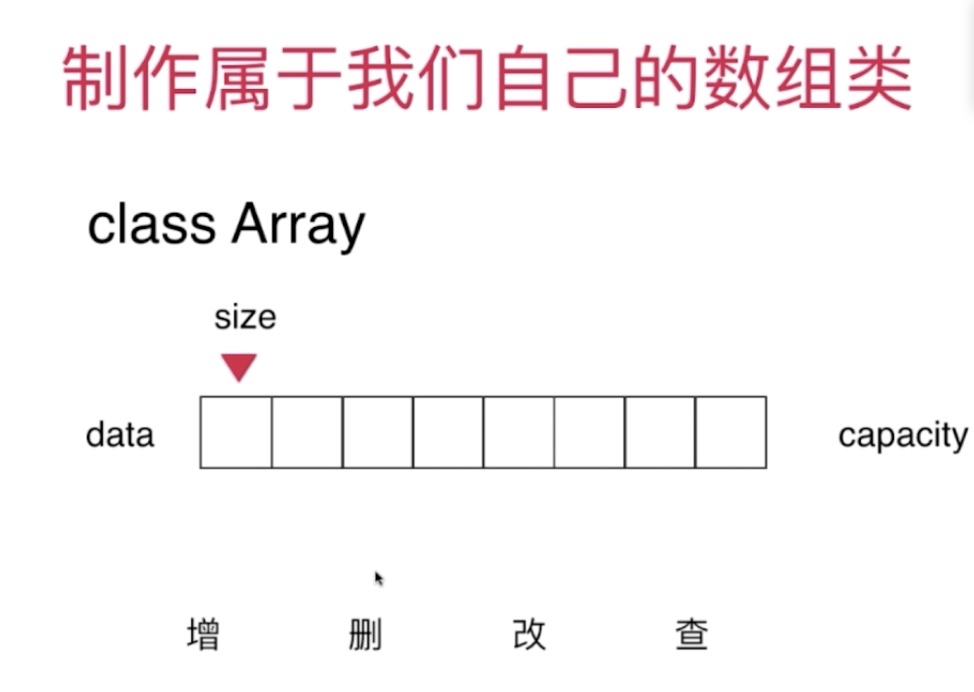

capacity 是这个数组的容量，size是实际存放的元素个数，所以后续需要维护 size。

```Java
public class Array{
    
    private int[] data;
    private int size;
    
    //构造函数，传入数组的容量 capacity 构造 Array
    public Array(int capacity){
        data = new int[capacity];
        size = 0;
    }
    //无参构造函数，有参构造函数定以后，无参构造函数不会自动生成；默认数组容量为 capacity=10
    putlic Array(){
        this(10);
    }
  
    //获取数组中的元素个数  
    public int getSize(){
        return size;
    }
    
    // 获取数组的容量
    public int getCapacity(){
        return data.length;
    }
    
    // 返回数组是否为空
    public boolean isEmpty(){
        return size == 0;
    }
}
```

## 2-3 向数组中添加元素
1. 想数组末尾添加元素
    初始化 size = 0；
    向数组中添加元素就相当于在 size 位置添加元素，加入后，size 需要自增。
1. 向第 index 个位置插入元素
    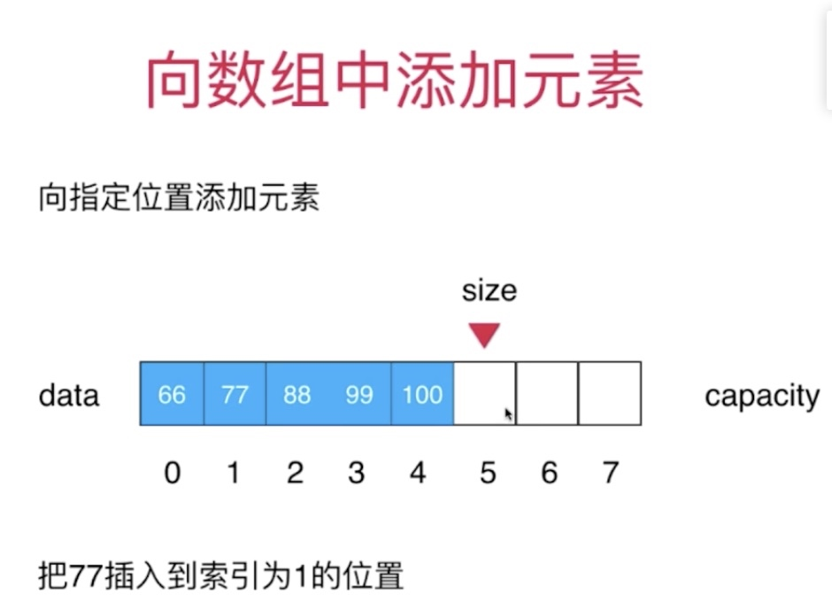
需要先把88，99，100依次往后挪，然后把77放入索引为1的位置，之后 size++。

 ```Java
public class Array{
    
        private int[] data;
        private int size;
        
        //构造函数，传入数组的容量 capacity 构造 Array
        public Array(int capacity){
            data = new int[capacity];
            size = 0;
        }
        //无参构造函数，有参构造函数定以后，无参构造函数不会自动生成；默认数组容量为 capacity=10
        putlic Array(){
            this(10);
        }
      
        //获取数组中的元素个数  
        public int getSize(){
            return size;
        }
        
        // 获取数组的容量
        public int getCapacity(){
            return data.length;
        }
        
        // 返回数组是否为空
        public boolean isEmpty(){
            return size == 0;
        }
        
        //向数组所有元素后添加一个新元素
        public void addLast(int e){
            //如果数组满了，不能添加新元素，抛出异常
            if(size == data.length){
                throw new IllegalArgumentException("Addlast failed. Array is full.");
            }
            
            data[size] = e;
            size ++;
        }
        /*本节新增*/
        //有了下面这个在 index 位置添加元素的函数 add，那么上面 addLast 就可以复用add 这个函数了，下面给出重新实现：
        public void addLast(int e){
            //向最后一个位置添加元素就是向第 size 个位置添加元素，size 始终指向最后一个元素的后一个空位置
            add(size, e);
        }
        
        /*本节新增*/
        //同理，可以借助 add 实现 addFirst
        public void addLast(int e){
            //在开头添加就是在索引为0处添加
            add(0, e);
        }
        
        /*本节新增*/
        //向第 index个位置添加一个新元素
        public void add(int index, int e){
            //如果数组满了，不能添加新元素，抛出异常
            if(size == data.length){
                throw new IllegalArgumentException("Add failed. Array is full.");
            }
            //1. 因为 size 初始值为0，指向数组第一个位置，与初始下标0一致，所以最后一个元素是 arr[size]而非 arr[size - 1];
            //2. 如果 index 取比 size大的值，说明数组中的元素将不会是紧密排列的，中间会有空置未用的位置
            if(index < 0 ||  index > size){
                throw new IllegalArgumentException("Add failed. Require index >= 0 and index <= size");
            }   
            //从最后一个位置的元素（size-1）开始，依次往后挪一个位置        
            for(int i=size-1; i>=index; i--){
            data[i+1] = data[i]; 
            }
            
            data[index] = e;
            size ++;
        }   
}
 ```
## 2-4 数组中查询和修改元素
```Java
public class Array{
    
        private int[] data;
        private int size;
        
        //构造函数，传入数组的容量 capacity 构造 Array
        public Array(int capacity){
            data = new int[capacity];
            size = 0;
        }
        //无参构造函数，有参构造函数定以后，无参构造函数不会自动生成；默认数组容量为 capacity=10
        putlic Array(){
            this(10);
        }
      
        //获取数组中的元素个数  
        public int getSize(){
            return size;
        }
        
        // 获取数组的容量
        public int getCapacity(){
            return data.length;
        }
        
        // 返回数组是否为空
        public boolean isEmpty(){
            return size == 0;
        }
        
        //向数组所有元素后添加一个新元素
        public void addLast(int e){
            //如果数组满了，不能添加新元素，抛出异常
            if(size == data.length){
                throw new IllegalArgumentException("Addlast failed. Array is full.");
            }
            
            data[size] = e;
            size ++;
        }
        //有了下面这个在 index 位置添加元素的函数 add，那么上面 addLast 就可以复用add 这个函数了，下面给出重新实现：
        public void addLast(int e){
            //向最后一个位置添加元素就是向第 size 个位置添加元素，size 始终指向最后一个元素的后一个空位置，size-1始终是数组最后一个元素位置
            add(size, e);
        }
        
        //同理，可以借助 add 实现 addFirst
        public void addLast(int e){
            //在开头添加就是在索引为0处添加
            add(0, e);
        }
        
        //向第 index个位置添加一个新元素
        public void add(int index, int e){
            //如果数组满了，不能添加新元素，抛出异常
            if(size == data.length){
                throw new IllegalArgumentException("Add failed. Array is full.");
            }
            //1. 因为 size 初始值为0，指向数组第一个位置，与初始下标0一致，最后一个元素是arr[size - 1]， 即数组的第一个空位置是 size, 为了保证数组紧密存储，下一个元素必须添加在 size 位置上，否则， 见2
            //2. 如果 index 取比 size大的值，说明数组中的元素将不会是紧密排列的，中间会有空置未用的位置
            if(index < 0 ||  index > size){
                throw new IllegalArgumentException("Add failed. Require index >= 0 and index <= size");
            }   
            //从最后一个位置的元素（size-1）开始，依次往后挪一个位置        
            for(int i=size-1; i>=index; i--){
            data[i+1] = data[i]; 
            }
            
            data[index] = e;
            size ++;
        } 
        
        /*本节新增*/
        //获取 index索引位置的元素
        int get(int index){
            //保证了不在 size 范围内的元素不会被获取到，保护了数据的安全
            if(index < 0 || index >= size){
                throw new IllegalArgumentException("Get failed. Index is invalid.");   
            }
            
            return data[index];
        }
        /*本节新增*/
        //获取 index索引位置的元素
        int set(int index, int e){
            //保证了不在 size 范围内的元素不会被修改，保护了数据的安全
            if(index < 0 || index >= size){
                throw new IllegalArgumentException("Get failed. Index is invalid.");   
            }
            
            data[index] = e;
        }
        
        /*本节新增*/
        //格式化打印数组内容
        #Override //如果下面方法名打错，编译器会给出提示，因为目的是覆盖父类的一个方法，而不是新增一个方法
        public String toString(){
            StringBuilder res = new StringBuilder();
            res.append(String.format("Array: size = %d, capacity = %d\n", size, data.length));
            res.append('[');
            for(int i=0; i<size; i++){
                res.append(data[i]);
                //如果不是最后一个元素（最后一个元素位置为 size-1）
                if(i != size -1){
                    res.append(", ");
                }
            }
            
            res.append(']');
            return res.toString();
        }  
}
```

    ```Java
    测试一下上面的自定义的数组类
    public class Main{
        
        public static void main(String[] args)
    
        Array arr = new Array(20);
        for(int i=0; i<10; i++){
            arr.addLast(i);
        }
        
        System.out.println(arr);
        
        arr.add(1, 100);
        System.out.println(arr);
        
        arr.addFirst(-1);
        System.out.println(arr);
    }
    
    ```

## 2-5 包含、搜索和删除
1. 判断是否包含元素 e
2. 查找元素 e 所在的索引
3. 删除数组中某个元素，删除后需要维护 size的值
    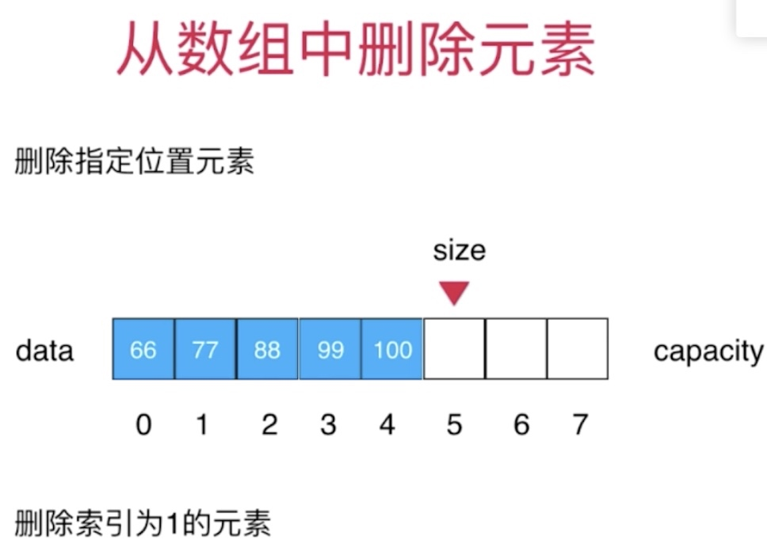


```Java
public class Array{
    
        private int[] data;
        private int size;
        
        //构造函数，传入数组的容量 capacity 构造 Array
        public Array(int capacity){
            data = new int[capacity];
            size = 0;
        }
        //无参构造函数，有参构造函数定以后，无参构造函数不会自动生成；默认数组容量为 capacity=10
        putlic Array(){
            this(10);
        }
      
        //获取数组中的元素个数  
        public int getSize(){
            return size;
        }
        
        // 获取数组的容量
        public int getCapacity(){
            return data.length;
        }
        
        // 返回数组是否为空
        public boolean isEmpty(){
            return size == 0;
        }
        
        //向数组所有元素后添加一个新元素
        public void addLast(int e){
            //如果数组满了，不能添加新元素，抛出异常
            if(size == data.length){
                throw new IllegalArgumentException("Addlast failed. Array is full.");
            }
            
            data[size] = e;
            size ++;
        }
        //有了下面这个在 index 位置添加元素的函数 add，那么上面 addLast 就可以复用add 这个函数了，下面给出重新实现：
        public void addLast(int e){
            //向最后一个位置添加元素就是向第 size 个位置添加元素，size 始终指向最后一个元素的后一个空位置，size-1始终是数组最后一个元素位置
            add(size, e);
        }
        
        //同理，可以借助 add 实现 addFirst
        public void addLast(int e){
            //在开头添加就是在索引为0处添加
            add(0, e);
        }
        
        //向第 index个位置添加一个新元素
        public void add(int index, int e){
            //如果数组满了，不能添加新元素，抛出异常
            if(size == data.length){
                throw new IllegalArgumentException("Add failed. Array is full.");
            }
            //1. 因为 size 初始值为0，指向数组第一个位置，与初始下标0一致，最后一个元素是arr[size - 1]， 即数组的第一个空位置是 size, 为了保证数组紧密存储，下一个元素必须添加在 size 位置上，否则， 见2
            //2. 如果 index 取比 size大的值，说明数组中的元素将不会是紧密排列的，中间会有空置未用的位置
            if(index < 0 ||  index > size){
                throw new IllegalArgumentException("Add failed. Require index >= 0 and index <= size");
            }   
            //从最后一个位置的元素（size-1）开始，依次往后挪一个位置        
            for(int i=size-1; i>=index; i--){
            data[i+1] = data[i]; 
            }
            
            data[index] = e;
            size ++;
        } 
        
        //获取 index索引位置的元素
        int get(int index){
            //保证了不在 size 范围内的元素不会被获取到，保护了数据的安全
            if(index < 0 || index >= size){
                throw new IllegalArgumentException("Get failed. Index is invalid.");   
            }
            
            return data[index];
        }
        //获取 index索引位置的元素
        int set(int index, int e){
            //保证了不在 size 范围内的元素不会被修改，保护了数据的安全
            if(index < 0 || index >= size){
                throw new IllegalArgumentException("Get failed. Index is invalid.");   
            }
            
            data[index] = e;
        }
        
        /*本节新增*/
        //查找数组中是否有元素 e
        public boolean contains(int e){
            for(int i=0; i<size; i++){
                if(data[i] == e){
                    return true;                
                }   
                
                return false;
            }
        }
        
        /*本节新增*/
        //查找数组中元素 e所在的索引，如果不存在元素 e,则返回-1
        //这个函数存在一个问题，是只能找到一个元素 e，函数就返回了，可以设计一个函数 findAll来完成查找数组中所有 e 的功能
        public int find(int e){
            for(int i=0; i<size; i++){
                if(data[i] == e){
                    return i;                
                }   
                
                //一般-1表示无效索引
                return -1;
            }
        }
        
        /*本节新增*/
        //从数组中删除 index位置的元素，返回删除的值
        public int remove(int index){
            //仍然先进性索引有效性判断
            if(index < 0 || index >= size){
                throw new IllegalArgumentException("Remove failed. Index is invalid.");    
            }
            
            //将要删除的元素保留下来，作为函数返回值
            int ret = data[index];
            
            //从删除的位置后面一个元素开始依次往前挪
            for(int i=index+1; i<size; i++){
                data[i-1] = data[i]; //依次往前挪
            }
            size --; //删除一个元素，维护一下 size
            return ret;
        }
        
        /*本节新增*/
        //根据上面的删除某一个元素的方法 Remove,可以创建下面的方法：
        //从数组中删除第一个元素
        public int removeFirst(){
            return remove(0);
            //这里实际上应该判断数组是否为空，但是这里不需要，因为在 remove 函数中会进行这个判断
        }
        
        /*本节新增*/
        //从数组中删除最后一个元素
        public int removeLast(){
            return remove(size - 1);
        }
        
        /*本节新增*/
        //从数组中删除某个元素，不是删除指定索引的元素，这里不需要返回那个删除的值，因为参数就是那个值
        //这个函数存在一个问题，是只能删除一个元素 e，函数就返回了，可以设计一个函数 removeAll来完成删除数组中所有 e 的功能
        public void removeElement(int e){
            //当然，可以遍历这个数组，一个一个元素进行比较，找到了就删除，然后返回，但是这里可以复用上面定义的方法
            int index = find(e);
            if(index != -1){
                remove(index);
            }
        }
        
        //格式化打印数组内容
        #Override //如果下面方法名打错，编译器会给出提示，因为目的是覆盖父类的一个方法，而不是新增一个方法
        public String toString(){
            StringBuilder res = new StringBuilder();
            res.append(String.format("Array: size = %d, capacity = %d\n", size, data.length));
            res.append('[');
            for(int i=0; i<size; i++){
                res.append(data[i]);
                //如果不是最后一个元素（最后一个元素位置为 size-1）
                if(i != size -1){
                    res.append(", ");
                }
            }
            
            res.append(']');
            return res.toString();
        }  
}
```

```Java
测试一下上面的自定义的数组类
public class Main{
    
    public static void main(String[] args)
    
    Array arr = new Array(20);
    for(int i=0; i<10; i++){
        arr.addLast(i);
    }
    
    System.out.println(arr);
    
    arr.add(1, 100);
    System.out.println(arr);
    
    arr.addFirst(-1);
    System.out.println(arr);
    
    /*本节新增*/
    arr.remove(2);
    System.out.println(arr);
    
    arr.removeElement(4);
    System.out.println(arr);
    
    arr.removeFirst();
    System.out.println(arr);
}
    
```

## 2-6 使用泛型

目前为止，创建的数组只能存放整型，可以使用泛型解决这个问题，使得数据结构可以存放任意的数据类型。

但是在Java中，一个泛型类并不是可以放置任意数据类型的，它不能放置**基本数据类型，只能放置类对象**

基本数据类型：boolean, byte, char, short, int, long, float, double

但是 Java 中对每个基本数据类型进行了包装，称为包装类，包括Boolean, Byte, Char, Short, Int, Long, Float, Double
*基本数据类型在需要时可以自动转换成它所对应的包装类，包装类也会在需要时自动转换成基本数据类型*

**下面对上面几节写的数组类代码进行泛型封装：**

```Java
public class Array<E>{
    
    private E[] data;
    private int size;
    
    public Array(int capacity){
        //data = new E[capacity]; //Java 不支持直接 new 一个泛型数组,通过下面的超级类 Object来进行转换
        data = new （E[]）Object[capacity]; //先 new 一个 Object 类数组，在进行强制类型转换成泛型数组
        size = 0;
    }
  
    public void add(int index, E e){
        
        if(size == data.length){
            throw new IllegalArgumentException("Add failed. Array is full.");
        }
        
        if(index < 0 ||  index > size){
            throw new IllegalArgumentException("Add failed. Require index >= 0 and index <= size");
        }   
        
        for(int i=size-1; i>=index; i--){
        data[i+1] = data[i]; 
        }
        
        data[index] = e;
        size ++;
        } 
        
    int get(int index){
        
        if(index < 0 || index >= size){
            throw new IllegalArgumentException("Get failed. Index is invalid.");   
        }
        
        return data[index];
    }
   
    int set(int index, E e){
        
        if(index < 0 || index >= size){
            throw new IllegalArgumentException("Get failed. Index is invalid.");   
        }
        
        data[index] = e;
    }
    
    public boolean contains(int e){
        for(int i=0; i<size; i++){
            //因为修改成泛型后，这里不再是值的比较了，而是对象，所以要修改成 equals 方法进行比较
            //if(data[i] == e) //值比较
            
        //引用比较
        if(data[i].equals(e)){
            return true;                
        }   
            
            return false;
        }
    }

    public E remove(int index){
        
        if(index < 0 || index >= size){
            throw new IllegalArgumentException("Remove failed. Index is invalid.");    
        }
        
        E ret = data[index];
        
        for(int i=index+1; i<size; i++){
            data[i-1] = data[i]; 
        }
        //data 数组使用泛型之前存储的都是 int数据，删除一个元素后，后面的依次往前挪，size--之后，虽然最后一个元素前挪后仍然存在，但是因为 size--了，所以是访问不到的，留着也没什么问题。
        //现在改成泛型后，data 数组中存放的都是类对象的引用，删除一个元素后，最后一个元素即 data[size]还指着一个类对象的引用，此时 Java 的垃圾回收机制是不会清理这个对象，因为 data[size]这个引用仍然指向了那个对象，说明那个对象还在使用。
        //如果愿意的话，可以加下面一句，断开这个引用和对象的关系，这样就会被回收机制清理内存了
        size --; 
        //下面这个也不是必须的，因为如果再存入一个元素，那么data[size]所指向的对象就换成了新的，原来的就没引用指向它了，这样就会被清理了。这种未使用但是有引用指向它，所以不会被清理内存，但是它会被后续数组的使用被停止原来对象的引用，从而清理掉这个对象的内存，这种类对象叫做 loitering objects，它与内存泄露不是一回事，做的更好的话，可以加上下面这句手动截断引用.
        data[size] = null; //loitering objects(闲散、游荡的) != memmory leak
        return ret;
    }

}
```

```Java
泛型测试：测试一下上面的泛型封装
public class Main{
    
    public static void main(String[] args)
    
    //这里要告诉定义的 Array 数组类具体是什么类型，告诉泛型到底使用的是哪种类型,这里不能使用 Array<int>，因为基本数据类型不支持泛型，所以要使用该 int 类型对应的包装类 Integer.
    Array< Integer> arr = new Array<>(20);
    for(int i=0; i<10; i++){
        arr.addLast(i);
    }
    
    System.out.println(arr);
    
    //在上面修改 add 函数时，第二个参数从 int e 修改为 E e 了，这里传入100为什么没问题呢？ 因为，E 在具体使用的 main函数中式指定的 Integer 类，它能和其对应的基本数据类型进行自动转换，所以这里100是个 int 类型，所以可以兼容上面指定的 Integer 类型
    arr.add(1, 100);
    System.out.println(arr);
    
    arr.addFirst(-1);
    System.out.println(arr);
    
    /*本节新增*/
    arr.remove(2);
    System.out.println(arr);
    
    arr.removeElement(4);
    System.out.println(arr);
    
    arr.removeFirst();
    System.out.println(arr);
}
    
```

```Java
public class Student{
    private String name;
    private int score;
    
    public Student(String studentName, int studentScore){
        name studentName;
        score = studentScore;
    }
    
    @override
    public String toString(){
        return String.format("Student(name: %s, score: %d)", name, score);
    }
    
    public static void main(String[] args){
        //泛型使用 - 泛型数组承载自定义类对象：定义并使用 Student 类数组
        //数组中存放的是 Student 类对象的引用，类对象在内存中，访问类对象只能通过这个引用
        Array<Student> arr = ne Array<>();
        arr.addLast(new Student("Alice", 100));
        arr.addLast(new Student("Bob", 66));
        arr.addLast(new Student("Charlie", 88));

        //println函数打印数组元素 Student 类对象时会调用Student 类中的 toString 方法，上面修改默认的toString 方法，就能得到自己想要打印的信息
        System.out.println(arr);
    }
}
```

## 2-7 动态数组

上面自定义二次封装了自己的数组类，实现了很多方法，可以操作这个数组类对象，并且通过泛型封装，使得这个数组类可以存放任意类型的元素。但是本质上它还是使用的一个静态数组。

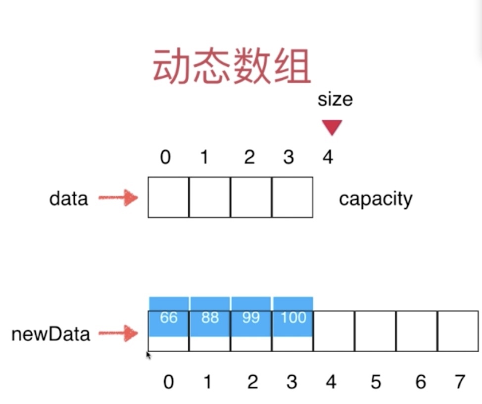
数组存满后，申请一个更大容量的数组，再把原来数组中的元素拷贝到新数组中；之后把 data 指向新的数组:
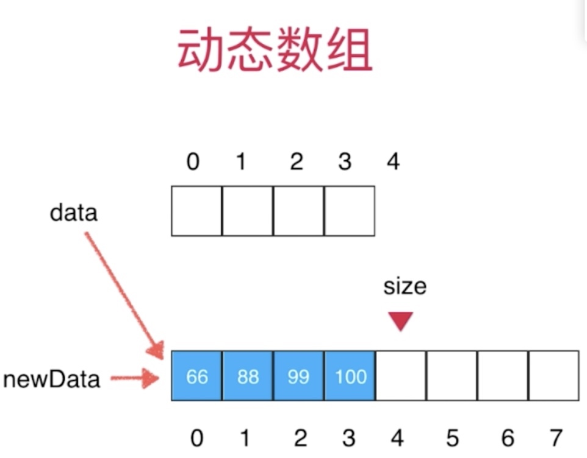
data 指向 newData 指向的新数组，newData 是在函数里申请的局部变量，使用完就释放掉了，data 是在类中定义的，它的生存周期与这个类相同。并且 data 与原数组使用了引用关系，原数组的内存会被垃圾清理机制清理掉。
最终结果为：
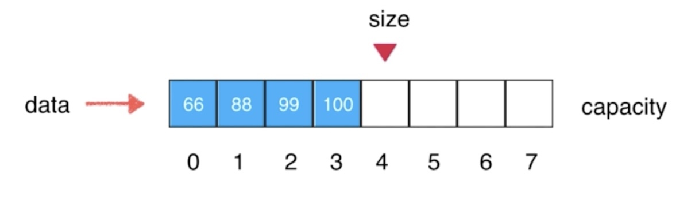
这是增长元素时，反之，在消减元素时，也可以使用反向的操作，避免空间的浪费。

这里把前面实现的 add、remove 方法拿过来加以说明，并实现了扩容、缩容函数resize：
```Java
//添加元素时扩容
public void add(int index, E e){
    
    if(index < 0 ||  index > size){
        throw new IllegalArgumentException("Add failed. Require index >= 0 and index <= size");
    }   
    
    if(size == data.length){
        //throw new IllegalArgumentException("Add failed. Array is full.");
        //数组容量达到 capacity,满了，此时不再抛出异常，而是进行动态扩容
        resize(2 * data.length); //这里不要扩容常数个容量，按比例扩容比较合理
    }
    
    //从最后一个位置的元素（size-1）开始，依次往后挪一个位置        
    for(int i=size-1; i>=index; i--){
    data[i+1] = data[i]; 
    }
    
    data[index] = e;
    size ++;
} 

private void resize(int newCapacity){
    //前面说过，Java 不能 new 一个泛型数组，要经过 new 一个 Object(超级父类)数组类进行转换
    这里也可以看到新的扩容的数组是一个局部变量指向的，下面 data 指向这个数组后，退出函数，newData就释放了
    E[] newData = (E[])new Object[newCapacity];
    for(int i=0; i<size; i++){
        newData[i] = data[i];       
    }
    
    data = newData;
}

//删除元素是缩减容量
public E remove(int index){
    if(index < 0 || index >= size){
        throw new IllegalArgumentException("Remove failed. Index is invalid.");    
    }

    E ret = data[index];

    for(int i=index+1; i<size; i++){
        data[i-1] = data[i]; 
    }
    size --; 
    data[size] = null; //loitering objects
    
    //缩减容量，因为扩容时按照扩容2倍来计算的，所以缩容时也缩减一半
    if(size == data.length/2){
        resize(data.length/2);           
    }
    
    return ret;
}


```

```Java
泛型测试：测试一下上面的泛型封装
public class Main{
    
    public static void main(String[] args)
    
    //这里要告诉定义的 Array 数组类具体是什么类型，告诉泛型到底使用的是哪种类型,这里不能使用 Array<int>，因为基本数据类型不支持泛型，所以要使用该 int 类型对应的包装类 Integer.
    Array< Integer> arr = new Array<>(); //这里不加参数，使用默认容量，默认容量在 Array 类定义的无参构造函数中，是10
    //将这10个数组的空间填满
    for(int i=0; i<10; i++){
        arr.addLast(i);
    }
    
    //数组满了，再加一个数组，进行扩容函数的测试
    arr.add(1, 100);
    //通过打印 arr 数组信息 capacity，可以看到容量变成了20，已经扩容了
    System.out.println(arr);
    
    
    arr.addFirst(-1);
    System.out.println(arr);
}
    
```

## 2-8 简单的复杂度分析

大$O$描述的是算法的运行时间和输入数据之间的关系
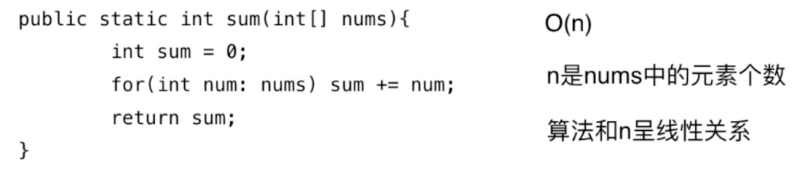

为什么要用大 O，叫做 O(n)？
忽略常数。上面程序实际时间 $T = c1*n +c2$

* *c1指的是上面程序中重复执行的指令中一次计算执行的多条指令总共运行的时间。上面程序中就是for 循环里的多条指令执行的时间。*
* *c2指的是不是每次都重复执行的代码运行时间之和。上面程序中就是 for 循环外执行的指令，如 int sum = 0;和 return sum;*

实际分析算法时把c1和c2都分析出来，没有必要，有时候也是不太可能的。因为不同语言不同实现转换成机器码，对应的机器码指令数可能不同，所以运行时间也不同，即使机器码指令数相同，但是底层 cpu 不同，执行一条指令的时间也是不统一的。所以实际上能知道 c1、c2是几条指令，但是实际上运行时间是很难精确的估计出来具体是多少的。所以算法复杂度分析经常忽略常数。

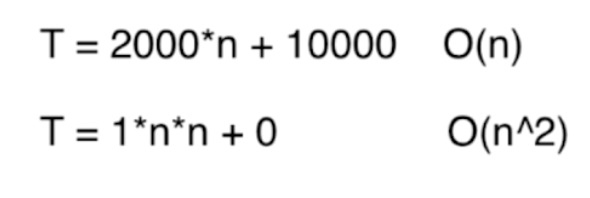

这里有一个疑问：当 n 比较小时，明显第一个比第二个运行时间长，为什么说第二个算法的复杂度更高，性能更差呢？
**解答**：大O 的表示实际翻译成中文叫：**渐进时间复杂度**，是描述 n 趋近于无穷的情况下，不同算法孰快孰慢的。

当然这种 n 比较小的时候复杂度较好的特点，也能得到实际的运用。比如：在处理一些小数组的时候，可以使用插入排序替代快速排序或归并排序进行代码优化，可以得到15%左右的性能提升。

$T = 2*n*n + 300n + 10$  $O(n^2)$
忽略低阶项，在 n 趋近于无穷时，低阶项对结果的影响很小。

下面分析前面数组类中实现的方法的时间复杂度：
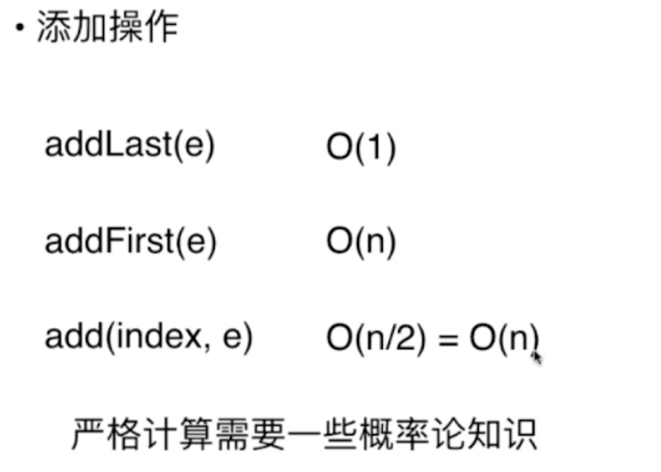

addLast 操作，不需要移动数组其它元素，所以是常数复杂度，即与问题规模 n 无关;
addFirst 操作，每次都要往后移动数组中所有元素，对于问题规模为 n 的，他要移动n 次元素;
add 操作，与插入索引位置有关，如果为1，则与 addFirst 相同，如果为 n，那么与 addLast 相同，精确的复杂度计算需要概率论的知识，假设 index 取到1-n 的范围中每一个值的范围相同，那么可以精确计算它的期望，即为时间复杂度。在实际中可以粗略用平均的方法，即 index 取到 n/2，此时的复杂度为平均复杂度，为 O(n/2) = O(n) .

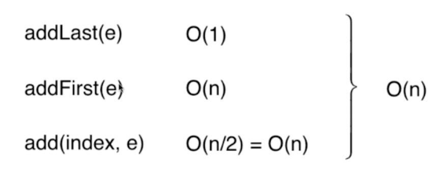
上面添加操作的整体复杂度是 O(n)级别的，因为时间复杂度是计算最糟情况下的复杂度

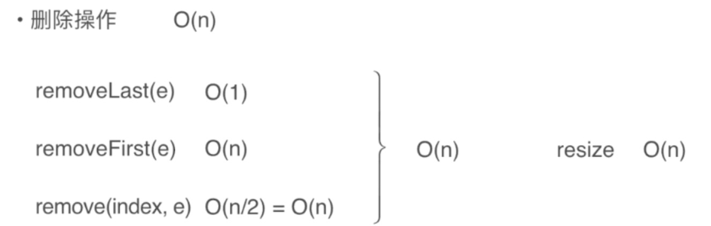

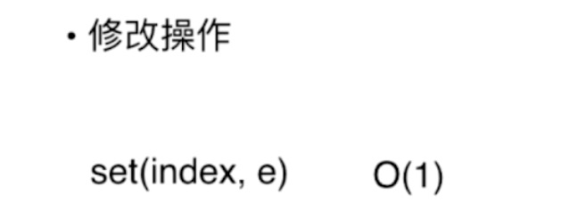
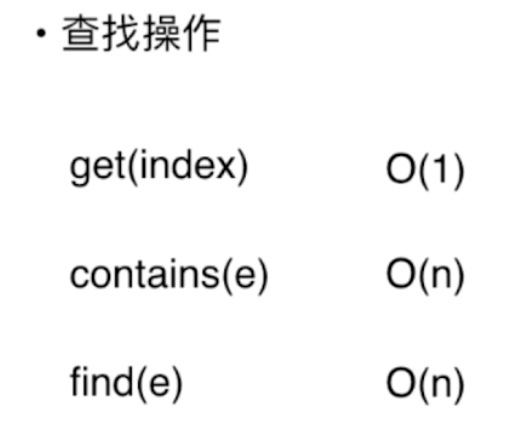

上面是对于静态数组时间复杂度的分析，对于动态数组的时间复杂度为：
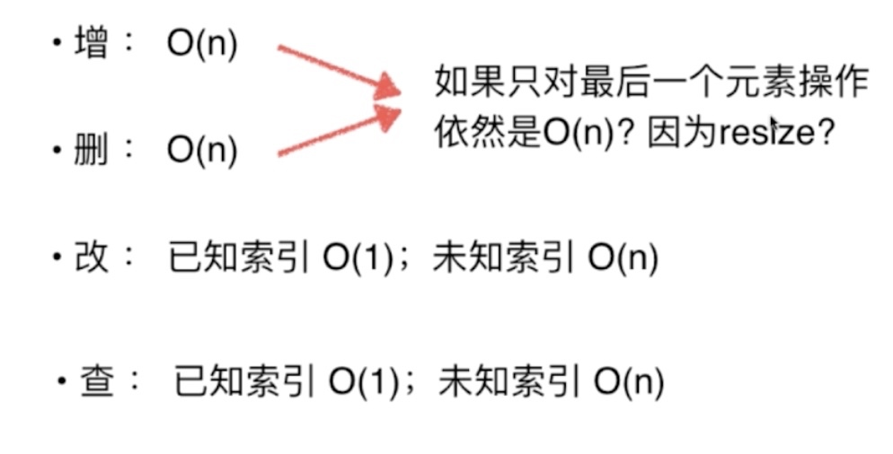
这里可以看到如果已知索引，那么时间复杂度是常数级别的，如果未知索引，那么就是 O(n)级别的。所以索引取的有语意还是比较重要的。
另外，对于增和删，它们时间复杂度都是 O(n),因为它里面包含了 resize 函数，这个函数时O(n)的，因为每次扩容，都要把原来数组内容拷贝一遍。这样来看，resize 函数性能较差，影响了增和删函数的性能，但实际上并非这样，完全使用最糟时间复杂度是不合理的，下节将介绍均摊时间复杂度，可以看到，resize 并非性能那么差。

## 2-9 均摊复杂度和防止复杂度震荡

上节说到 resize 函数，实际上，并不是每次都触发这个函数的。
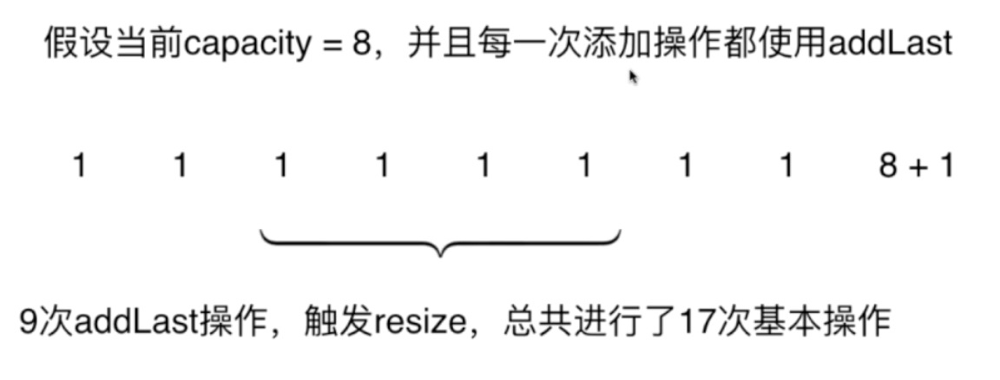
添加一个元素是一次操作，上面添加8次，一共触发8次操作，之后添加第9个元素时，会触发一次扩容，要拷贝原数组内容（8次），再添加第9个元素，所以一共进行了17次基本操作。

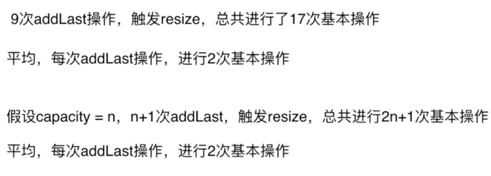
即每 n+1次操作，触发一次 resize，把 resize 中的2n 次拷贝操作的时间均摊到n+1次的 addLast 操作中，得到平均每次 addLast 有2次基本操作。
这意味着，这样均摊时间，时间复杂度是 O(1)的。在这种情况下，计算均摊时间复杂度比计算最坏时间复杂度更有意义。
实际工程中，如果一个比较耗时的操作不是每次都触发的时候，这个耗时操作是可以分摊到其它的操作中去的。
同样分析 removeLast,最坏情况是O(n)级别的，但是均摊复杂度都是O(1)级别的。

**复杂度震荡**：
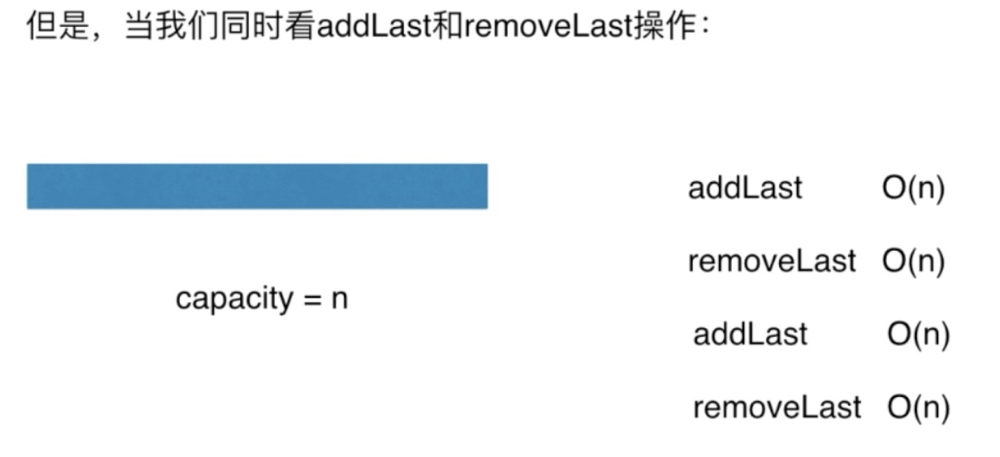

对于之前实现的动态数组的 addLast 和 removeLast 函数，其中都要调用 resize 函数。如果添加一个元素，超出容量，需要扩容，此时触发 resize，执行一次 原数组 n 个元素的拷贝操作；紧接着又删除了一个元素，此时又触发了缩容操作，又要拷贝 n次数据。这种情况依次进行下去，形成震荡。
出现问题的原因：removeLast 时 resize 过于着急（Eager）
解决方案：Lazy
添加时，达到 capacity 后，就开始扩容，但是缩容时，不着急。删除元素后，不着急缩容，等等看是否还有删除操作。当容量剩余数组容量的1/4时，判断后面的空间确实用不到了，此时开始缩容。
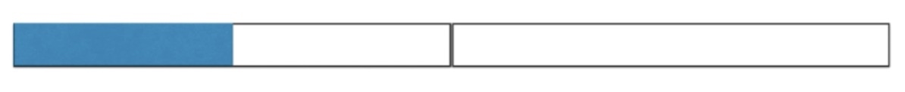
这里，缩容只是缩容整个数组的一半：即当 size == capacity/4时，才将 capacity 减半。
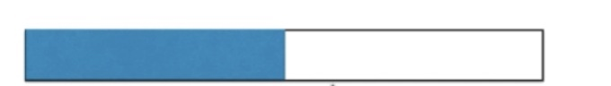

上述 Lazy 机制的实现：
```Java
public E remove(int index){
    if(index < 0 || index >= size){
        throw new IllegalArgumentException("Remove failed. Index is invalid.");    
    }

    E ret = data[index];

    for(int i=index+1; i<size; i++){
        data[i-1] = data[i]; 
    }
    size --; 
    data[size] = null; //loitering objects
    
    //Lazy 缩容，解决时间复杂度震荡问题
    //if(size == data.length/2){
    //这里有个 bug，缩容到最后 data.length 只剩下1时，data.length/2将会出现结果为0的情况
    //当 data.length 为4,size == 1时会进行缩容，缩减为容量为2；当size == 0, data.length 为3时，进行缩容，缩容到容量为1；
    //当 size == 0, data.length 为2时，也会触发下面代码，但是容量仍保持为1. 容量为1是缩容的最小容量了。
    //如果 data.length 为1，那么缩容到 data.length/2的话，就是缩容到0，resize中有 new 一个数组的操作，new 一个容量为0 的数组是不可以的。
    if(size == data.length/4 && data.length/2 != 0){
        resize(data.length/2);           
    }
    
    return ret;
}

```
